# react-stack-layout [](https://www.npmjs.com/package/@skbkontur/react-stack-layout) [](http://tech.skbkontur.ru/react-stack-layout/)

Library for quick arrangement of controls in vertical or horizontal stacks.
Essentially, it represents a [layout manager](https://en.wikipedia.org/wiki/Layout_manager) from the world of Desktop applications.
This library is particularly well-suited for simple interfaces or rapid prototyping.

## Justification

Very often when developing business logic, you need to quickly align controls horizontally one after another,
aligning them, for example, by the baseline, while remembering that there should be a small
spacing between them. When coding such layouts multiple times, code duplication appears.

In this library, I've generalized the most common scenarios for control placement and created several convenient
abstractions built on top of flexbox.

Plus a small bonus: such code is understandable to anyone.

## Idea

Suppose you need to arrange several controls in a specific way. Instead of adding
additional styles to elements, we propose creating a template (or framework) with placeholders, inside
which you can place the needed elements.

## What do we have?

### Root elements
* RowStack — arranges child elements in a row.
* ColumnStack — arranges child elements in a column, one under another.

### Placeholders
* Fit — takes the size corresponding to its content.
* Fill — occupies all available space.
* Fixed — has a fixed size.

## How to use

### Installation

```
npm install @skbkontur/react-stack-layout
```

or

```
yarn add @skbkontur/react-stack-layout
```

and import

```
import { ColumnStack, RowStack, Fill, Fit, Fixed } from "@skbkontur/react-stack-layout";
```

## Documentation

### RowStack

Arranges elements in a row and has two main properties: `verticalAlign` and `gap`. It doesn't wrap elements to the next line if there's not enough space (so keep that in mind!).

- `verticalAlign` takes values like `top`, `bottom`, `center`, `baseline`, or `stretch` and determines how the placeholder will be positioned vertically inside the container. Pretty straightforward, right?
- `gap` defines the horizontal spacing between placeholders. Nothing fancy here.

#### Basic Example

```tsx
<RowStack verticalAlign="top">
    <Fit>
        <YellowItem />
    </Fit>
    <Fit>
        <GreenItem />
    </Fit>
    <Fit>
        <BlueItem />
    </Fit>
</RowStack>
```

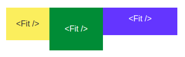

To help you understand the relationships and sizes of elements (because who doesn't love a good visual guide):

- The gray frame shows the parent element containing our container.
- The blue frame represents the container itself (RowStack or ColumnStack).
- The red frame indicates the placeholder (Fit, Fill, or Fixed) for your content.

So basically, the example above looks like this:

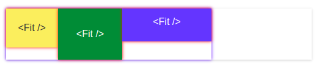

#### Gap property

```tsx
<RowStack verticalAlign="top" gap={4}>
    {/*...*/}
</RowStack>
```

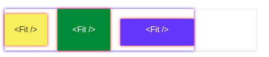

#### Using verticalAlign options

```tsx
<RowStack verticalAlign="baseline" gap={4}>
    {/*...*/}
</RowStack>
```

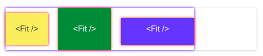

```tsx
<RowStack verticalAlign="bottom" gap={4}>
    {/*...*/}
</RowStack>
```

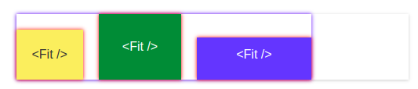

Stretch - placeholders stretch to the height of the container. But they don't stretch the container itself.

```tsx
<RowStack verticalAlign="stretch" gap={4}>
    {/*...*/}
</RowStack>
```

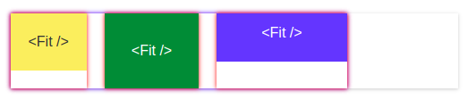

Center — not the same as baseline :-)

```tsx
<RowStack verticalAlign="center" gap={4}>
    {/*...*/}
</RowStack>
```

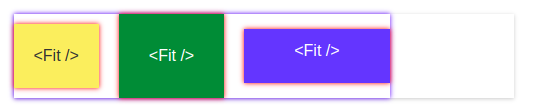

Note that the container doesn't take up the full width of the parent. By default, RowStack uses `display: inline-flex;`, which is more convenient in most cases.

To make the container a block element, use the `block` property.

```tsx
<RowStack block verticalAlign="center" gap={4}>
    {/*...*/}
</RowStack>
```

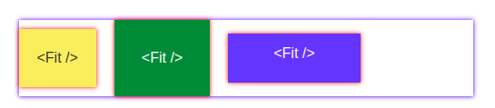

#### Fill

Fill stretches to occupy all available width.

```tsx
<RowStack block verticalAlign="top">
    <Fit><YellowItem /></Fit>
    <Fill><GreenItem /></Fill>
    <Fit><BlueItem /></Fit>
</RowStack>
```

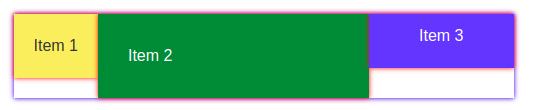

Note that only the container's space is used. If you remove the `block` property, the green element won't take up as much space:

```tsx
<RowStack verticalAlign="top">
    <Fit><YellowItem /></Fit>
    <Fill><GreenItem /></Fill>
    <Fit><BlueItem /></Fit>
</RowStack>
```

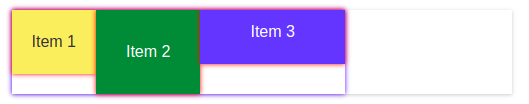

#### Fixed

Fixed gives the placeholder a fixed width.

```tsx
<RowStack verticalAlign="top">
    <Fit><YellowItem /></Fit>
    <Fixed width={200}><GreenItem /></Fixed>
    <Fit><BlueItem /></Fit>
</RowStack>
```

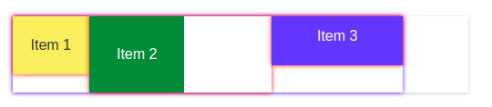

When there's not enough space in the placeholder:

```tsx
<RowStack verticalAlign="top">
    <Fit><YellowItem /></Fit>
    <Fixed width={70}><GreenItem /></Fixed>
    <Fit><BlueItem /></Fit>
</RowStack>
```

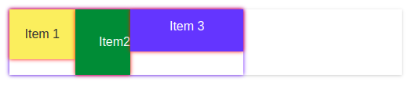

And when there's not enough space in the container:

```tsx
<RowStack verticalAlign="top">
    <Fit><YellowItem /></Fit>
    <Fixed width={400}><GreenItem /></Fixed>
    <Fit><BlueItem /></Fit>
</RowStack>
```

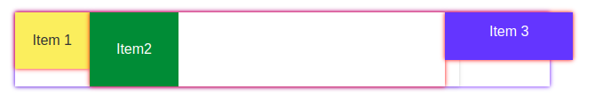

So, Fixed has some issues. Use it with care.

### ColumnStack

Arranges elements in a column and has two main properties: `horizontalAlign` and `gap`.

- `horizontalAlign` takes values like `left`, `right`, `center`, or `stretch` and determines how the **placeholder** will be positioned horizontally inside the container.
- `gap` defines the vertical spacing between placeholders.

#### Basic Example

```tsx
<ColumnStack horizontalAlign="left" gap={5}>
    <Fit><YellowItem /></Fit>
    <Fit><GreenItem /></Fit>
    <Fit><BlueItem /></Fit>
</ColumnStack>
```

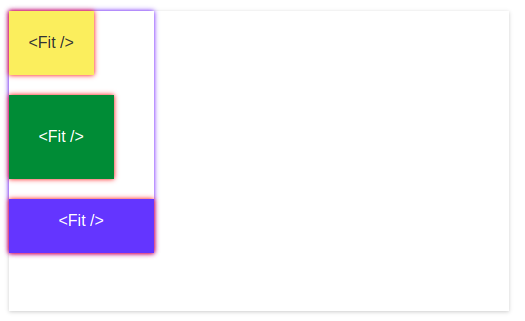

#### Using horizontalAlign options

```tsx
<ColumnStack horizontalAlign="center" gap={5}>
    {/*...*/}
</ColumnStack>
```

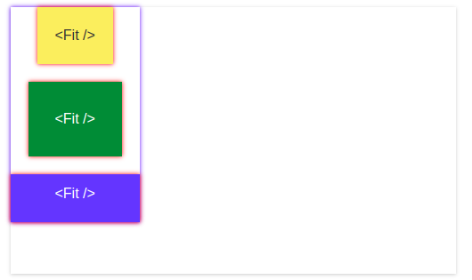

```tsx
<ColumnStack horizontalAlign="right" gap={5}>
    {/*...*/}
</ColumnStack>
```

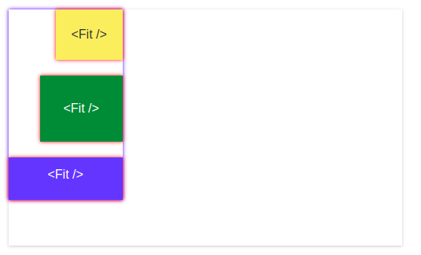

Stretch — placeholders stretch to the width of the container. But they don't stretch the container itself.

```tsx
<ColumnStack horizontalAlign="stretch" gap={5}>
    {/*...*/}
</ColumnStack>
```

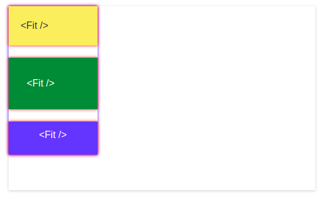

Don't forget about the `block` property, which makes the element a block element:

```tsx
<ColumnStack block horizontalAlign="stretch" gap={5}>
    {/*...*/}
</ColumnStack>
```

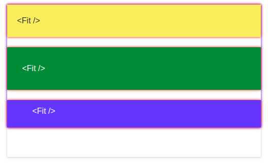

**!!! Fixed for ColumnStack is not applicable in version 1.0.0 !!!**

Fill stretches to take up all available height. Remember that the available height is chosen for the container, not for its parent. In the following example, the green element didn't stretch the container to the height of the parent.

```tsx
<ColumnStack horizontalAlign="left" gap={5}>
    <Fit><YellowItem /></Fit>
    <Fill><GreenItem /></Fill>
    <Fit><BlueItem /></Fit>
</ColumnStack>
```

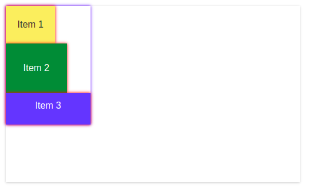

To make it work, you need to make the container as tall as its parent:

```tsx
<ColumnStack horizontalAlign="left" gap={5} style={{ height: "100%" }}>
    <Fit><YellowItem /></Fit>
    <Fill><GreenItem /></Fill>
    <Fit><BlueItem /></Fit>
</ColumnStack>
```

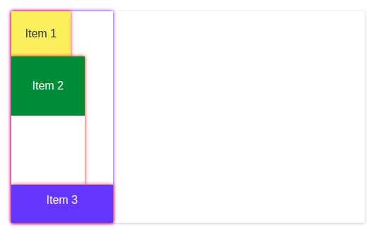

### Shorthand properties

For common cases of `verticalAlign` or `horizontalAlign`, there are simple shortcuts:

```tsx
<RowStack baseline />
```

And for ColumnStack:

```tsx
<RowStack stretch />
```

## Usage Examples

Common arrangement of controls from [react-ui](https://github.com/skbkontur/retail-ui).

### Example 1. Controls aligned by baseline.

```tsx
<RowStack baseline block gap={2}>
    <Fit><Input /></Fit>
    <Fit><Button use="primary">Search</Button></Fit>
    <Fit><Checkbox>Prohibited content</Checkbox></Fit>
</RowStack>
```

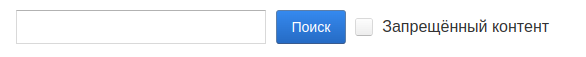

### Example 2. Wide input.

```tsx
<RowStack baseline block gap={2}>
    <Fill><Input width="100%" /></Fill>
    <Fit><Button use="primary">Search</Button></Fit>
    <Fit><Checkbox>Prohibited content</Checkbox></Fit>
</RowStack>
```

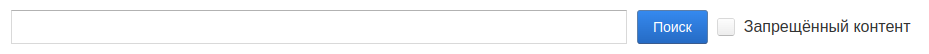

### Example 3. Another wide input.

```tsx
<RowStack baseline block gap={2}>
    <Fill><Input width="100%" /></Fill>
    <Fit><Button use="primary" disabled>Search</Button></Fit>
    <Fit><Spinner type={"mini"} caption="Spinner" /></Fit>
</RowStack>
```

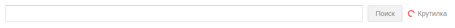

### Example 4. Elements at opposite ends.

```tsx
<RowStack baseline block gap={2}>
    <Fit><Button>Button 1</Button></Fit>
    <Fill />
    <Fit><Button>Button 2</Button></Fit>
    <Fit><Button>Button 3</Button></Fit>
</RowStack>
```


[Drop me a line](mailto:tihonov.ea@gmail.com) if you know how to expand the list of examples.

## Known Issues

- Sometimes, well actually quite often, there are extra DOM elements (I'm willing to pay that price for code clarity and uniformity).
- There are a few bugs (help wanted!).
- Issues with vertical Fill. Using it can sometimes be a bit awkward.
- Fixed doesn't work with ColumnStack.

## Usage Scenarios and Special Considerations

A few more words about usage:

- Containers are not a replacement for regular layouts. You shouldn't use them for complex and tricky components.
- Using these components should simplify your layout, not complicate it.
- In the source code of a single component, you shouldn't use more than three, maybe four, levels of nested components.

## API Reference

### `<RowStack />`

Container element in which placeholders (Fit, Fixed, or Fill) must be direct children. Arranges elements horizontally.

#### Props

- `verticalAlign?: "top" | "bottom" | "center" | "baseline" | "stretch";`  
  *(default = "top")* Determines the vertical position of placeholders inside the container.

- `baseline?: boolean;`  
  Shortcut for `verticalAlign="baseline"`. If `verticalAlign` is already set, an exception will be thrown.

- `block?: boolean;`  
  Changes the element's `display` to `flex`. By default, the container is `inline-flex`.

- `inline?: boolean;`  
  Changes the element's `display` to `inline-flex`.

- `gap?: number;`  
  Sets the gap between elements in arbitrary units. `gap={1}` equals a 5px gap.

### `<ColumnStack />`

Container element in which placeholders (Fit or Fill) must be direct children. Arranges elements in a column.

#### Props

- `horizontalAlign?: "left" | "right" | "center" | "stretch";`  
  *(default = "left")* Determines the horizontal position of placeholders inside the container.

- `stretch?: boolean;`  
  Shortcut for `horizontalAlign="stretch"`. If `horizontalAlign` is already set, an exception will be thrown.

- `block?: boolean;`  
  Changes the element's `display` to `flex`. By default, the container is `inline-flex`.

- `inline?: boolean;`  
  Changes the element's `display` to `inline-flex`.

- `gap?: number;`  
  Sets the gap between elements in arbitrary units. `gap={1}` equals a 5px gap.

### `<Fit />`

Placeholder element. Takes up space corresponding to its content.

### `<Fill />`

Placeholder element. Takes up all available space in the container.

### `<Fixed />`

Placeholder element. Takes up a specified size. Only applicable inside RowStack.

#### Props

- `width: number;`  
  Required parameter. Corresponds to the width occupied in the container.